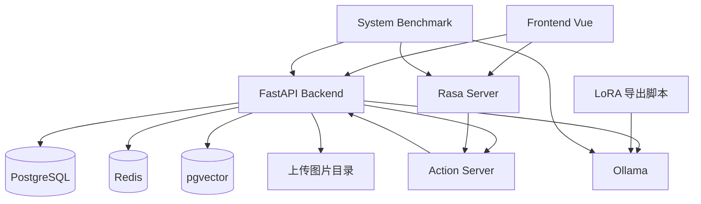

# 项目架构设计

## 1. 设计目标

Rasa-EC-bot 当前的目标不是单一聊天机器人，而是一个可运行的电商系统样例，覆盖以下能力：

- 用户侧电商闭环：商品浏览、购物车、下单、订单查询、售后申请。
- 商家侧运营闭环：商品管理、店铺管理、发货、售后处理。
- 智能客服闭环：规则型问答、交易查询、复杂多轮问答、图片售后分析。
- 论文实验闭环：支持系统形态对照 benchmark，并直接输出可用于论文的结果表。

系统设计采用“业务系统 + 对话系统 + 本地模型服务 + 实验工具链”并行演进的方式，避免把所有能力都堆在单一服务中。

## 2. 总体分层

### 2.1 前端层

- 目录：`frontend/`
- 技术：Vue 3、Vite、Pinia、Vue Router、Tailwind CSS
- 职责：
  - 用户端商城页面
  - 商家中心页面
  - 聊天客服界面
  - 图片上传与物流可视化展示

### 2.2 后端应用层

- 目录：`backend/`
- 技术：FastAPI、SQLModel、SQLAlchemy Async
- 职责：
  - 提供统一 REST API
  - 处理鉴权、订单、购物车、售后、商家管理
  - 提供客服统一入口 `/api/v1/chat/send`
  - 管理上传图片、知识库索引、Agent 工具调用
  - 提供给 Rasa Action Server 使用的内部摘要接口

### 2.3 对话编排层

- 目录：`rasa/`
- 技术：Rasa Open Source、Rasa SDK
- 职责：
  - 处理高频、确定性、流程清晰的客服意图
  - 维护规则型对话和 action 调用
  - 通过 Action Server 回调后端内部接口获取订单、物流、售后摘要

### 2.4 模型服务层

- 默认运行方式：Ollama
- 当前口径：
  - 基础聊天模型：`qwen3.5:2b`
  - Agent 默认模型：`qwen3.5:2b-lora`
  - 多模态模型：`qwen3-vl:2b`
  - 向量模型：`mxbai-embed-large`
- 职责：
  - 通用生成
  - LoRA 微调模型推理
  - 图片理解
  - 文本 embedding

### 2.5 数据与缓存层

- PostgreSQL：业务主库
- pgvector：知识库向量检索
- Redis：高频摘要和筛选元数据缓存
- 本地文件目录：聊天图片上传落盘

### 2.6 实验与评测层

- 目录：`backend/benchmarks/`、`backend/scripts/`
- 职责：
  - 构造场景化数据集
  - 通过 HTTP 接口压测不同系统形态
  - 输出性能和规则质量指标
  - 生成论文可复用结果表

## 3. 核心目录职责

```text
Rasa-EC-bot/
├─ backend/                    FastAPI 后端与 benchmark 主体
│  ├─ app/                     业务 API、模型、缓存、Agent 编排
│  ├─ db/                      建表与种子数据
│  ├─ benchmarks/              benchmark 配置、语料、结果目录
│  └─ scripts/                 数据集构建与基准执行脚本
├─ frontend/                   Vue 前端
├─ rasa/                       Rasa 机器人与 Action Server
│  ├─ actions/                 自定义 action
│  ├─ benchmark/rasa_only/     纯 Rasa 对照配置
│  └─ data/                    NLU 与规则数据
├─ LoRA/                       LoRA 数据处理、训练、评估、导出脚本
├─ tests/                      benchmark 评分规则测试
├─ requirement.md              需求说明
└─ design.md                   当前架构设计说明
```

## 4. 运行拓扑



说明：

- 前端的电商业务请求主要进入 FastAPI。
- Rasa Server 负责规则型客服链路。
- Action Server 不直接访问数据库，而是优先通过后端内部接口取业务摘要。
- Ollama 既服务基础模型，也服务 LoRA 模型、多模态模型与 embedding 模型。
- benchmark 只通过 HTTP 接口访问系统，不直接调用内部函数。

## 5. 关键业务链路

### 5.1 电商主链路

普通交易链路由前端直连后端：

1. 用户登录后获取 JWT。
2. 用户浏览商品、加入购物车、创建订单。
3. 商家在商家中心处理商品、发货和售后。
4. 后端统一维护订单、物流、售后状态。

这一部分与客服系统解耦，确保即使关闭聊天能力，电商功能仍然可运行。

### 5.2 客服主链路

统一入口为：

- `POST /api/v1/chat/send`

后端内部采用双路由：

1. 前端发送消息到后端。
2. 后端先做快速路由判断。
3. 如果是高频且确定性的意图，走 Rasa 规则链路。
4. 如果是复杂、多轮、跨领域、带附件或需要综合推理的问题，走 Agent 链路。
5. 最终统一返回 `messages[].text/cards/actions`，前端无需区分底层来源。

这种设计的核心价值是：

- 简单问题保持稳定和低成本。
- 复杂问题保留 LLM 的灵活性。
- 前端协议不需要因为路由策略变化而频繁改动。

### 5.3 Rasa 规则链路

规则链路适合：

- 问候
- 商品推荐类固定问法
- 订单查询
- 物流查询
- 售后状态查询

链路流程：

1. 后端将消息转给 Rasa。
2. Rasa 命中 intent 与 rule。
3. 需要业务数据时调用 Action Server。
4. Action Server 调后端内部摘要接口。
5. 结果回到 Rasa，再统一返回给前端。

关键收益：

- 规则可控
- 结果稳定
- 易于做“纯 Rasa”对照实验

### 5.4 Agent 链路

复杂问题由 `backend/app/nexau_orchestrator.py` 负责编排。

它的职责不是直接执行业务写操作，而是：

- 判断消息涉及的领域
- 生成工具调用计划
- 调用订单、物流、售后、知识库、图片分析等工具
- 汇总 observation
- 让本地模型生成最终答复

当前 Agent 设计遵守两个边界：

- 读操作可自动完成
- 写操作必须通过二次确认草案机制，不允许模型直接落库

这保证了系统在引入 Agent 后仍然保留业务安全边界。

### 5.5 图片售后链路

图片售后采用两步接口：

1. `POST /api/v1/chat/upload-image`
2. `POST /api/v1/chat/send`，并携带 `attachments`

后端会：

- 校验图片格式与大小
- 保存文件并生成 `attachment_id`
- 在 Agent 链路中调用图片分析工具
- 结合知识库与售后规则生成答复

这条链路主要服务于：

- 包裹破损
- 商品破损
- 收错货

## 6. 数据与状态管理

### 6.1 PostgreSQL

承担核心业务数据：

- 用户与商家
- 商品与店铺
- 购物车
- 订单与订单明细
- 物流
- 售后
- 聊天相关持久化对象
- 知识库文档与向量索引元数据

### 6.2 pgvector

用于多模态 RAG 的向量检索：

- 政策知识检索
- 说明书/手册检索
- Agent 检索增强

### 6.3 Redis

承担高频读缓存，降低数据库压力。

当前缓存重点包括：

- 商品筛选元数据
- 订单摘要
- 物流摘要
- 售后摘要

设计原则是“摘要缓存”，而不是把完整业务对象全部复制到缓存中。

### 6.4 本地上传目录

聊天图片采用本地目录保存：

- 减少对象存储依赖
- 便于本地开发与论文演示
- 与附件 ID 映射，供后续多模态分析使用

## 7. 模型与知识增强设计

### 7.1 基础模型

基础模型负责：

- 通用聊天
- 客服答复润色
- Agent 最终总结

### 7.2 LoRA 模型

LoRA 目录负责：

- 数据准备
- 训练
- 评估
- 导出为 Ollama 可用模型

当前导出入口：

- `LoRA/scripts/export_ollama_model.py`

它通过生成 `Modelfile`，把 LoRA 适配器注册为 Ollama 可直接调用的模型名，供后端和 benchmark 使用。

### 7.3 多模态与知识库

系统使用两类增强方式：

- 图片理解：`qwen3-vl:2b`
- 文档检索：embedding + pgvector

这样可以把客服从“纯文本问答”扩展为“图片售后 + 政策检索 + 说明书辅助”。

## 8. Benchmark 体系设计

当前 benchmark 已经从旧版 provider/layer 口径切换到“系统形态”口径。

### 8.1 对照系统

- `rasa_only`
- `llm_base_ollama`
- `llm_lora_ollama`
- `rasa_plus_llm_base`
- `rasa_plus_llm_lora`

### 8.2 业务场景

- `recommendation`
- `after_sales`
- `image_after_sales`

### 8.3 核心脚本

- `backend/scripts/build_system_benchmark_dataset.py`
- `backend/scripts/run_system_benchmark.py`

### 8.4 评测维度

- 性能维度：时延、吞吐、错误率
- 质量维度：任务成功率、规则通过率、能力支持情况

### 8.5 设计原则

- 只走 HTTP 接口，不直接调用内部函数
- 纯 Rasa 必须是单独实例，不能混用带 LLM fallback 的服务
- 图片场景采用全矩阵 + `unsupported/na`
- 输出结果直接服务论文写作

## 9. 启动与部署顺序

推荐启动顺序：

1. PostgreSQL 与 Redis
2. 后端 FastAPI
3. Ollama 与所需模型
4. Rasa Server
5. Rasa Action Server
6. 前端
7. Benchmark 脚本

如果只做 benchmark，可按实验对象最小化启动，不必拉起整个前端。

## 10. 当前架构边界

当前架构刻意保留以下边界：

- benchmark 不修改业务协议
- Rasa 与 Agent 共存，而不是相互替代
- 写操作必须经过确认机制
- LoRA 训练与业务运行解耦
- 模型部署默认以本地 Ollama 为主

这意味着系统既适合课程/论文演示，也适合继续扩展为更强的本地部署研究平台。

## 11. 后续可扩展方向

- 引入 vLLM 作为第二套模型服务后端，并保持同一 benchmark 口径
- 将图片与知识库检索进一步统一到单一 Agent 工具协议
- 把 benchmark 结果自动转换为论文图表
- 把配置拆成开发、论文实验、演示三套 profile

