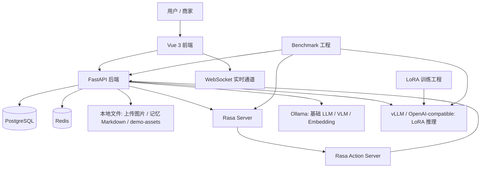

# Rasa-EC-bot 架构设计文档

## 1. 项目定位

Rasa-EC-bot 是一个面向电商客服场景的毕业设计实验系统，不是单一聊天机器人。当前项目同时包含可运行的电商业务系统、混合式智能客服链路、本地模型推理链路、LoRA 实验链路和独立 benchmark 评测工程。

系统的核心目标是：

- 支撑完整电商演示：商品浏览、商品推荐、购物车、下单、订单查询、物流查询、售后申请、商家发货和商家售后处理。
- 支撑混合客服能力：Rasa 负责高频规则型问题，LLM/Agent 负责复杂问题、推荐解释、知识检索、多模态图片分析和待确认事务草稿。
- 支撑本地化部署：PostgreSQL、Redis、Rasa、Ollama、vLLM/OpenAI-compatible 服务均可在本机运行，适合离线演示和可复现实验。
- 支撑实验评测：benchmark 作为独立工程运行，比较纯 Rasa、Rasa + LLM、Rasa + LoRA LLM 等方案在共享核心能力和 Agent 扩展能力上的表现。
- 支撑答辩演示稳定性：初始化数据、商品图和店铺 Logo 使用本地资源，避免外部图片站点不可用影响演示。

## 2. 当前系统总览



当前推荐演示拓扑是：所有服务运行在同一台 Windows 主机，另一台设备只通过 Tailscale 访问前端 `5173` 端口。前端通过 Vite 代理访问本机后端，后端继续用 `127.0.0.1` 访问 Rasa、Ollama、Redis 和 PostgreSQL，避免把内部模型服务暴露到 Tailnet。

## 3. 目录与模块边界

```text
Rasa-EC-bot/
├─ frontend/                  Vue 3 + Vite 前端商城、客服页、订单页、商家工作台
│  └─ public/demo-assets/      本地演示图片资源，商品图和店铺 Logo 从这里加载
├─ backend/                   FastAPI 后端，业务 API 与客服编排主入口
│  ├─ app/                    API、模型、认证、聊天路由、记忆、缓存、Agent 编排
│  ├─ db/                     init_db.sql 与 seed_data.sql
│  ├─ prompts/                Agent、Rasa 复审、图片分析等外置提示词
│  └─ scripts/                PostgreSQL 初始化脚本
├─ rasa/                      主线 Rasa 助手与 action server
│  └─ benchmark/rasa_only/     纯 Rasa benchmark 基线
├─ LoRA/                      LoRA 数据准备、训练、评估和导出链路
├─ benchmark/                 独立 benchmark 工程
├─ tests/                     后端核心逻辑单元测试
├─ README.md                  运行、演示和常用命令入口
├─ report.md                  实验报告与 benchmark 结论
└─ design.md                  当前架构设计文档
```

模块边界如下：

- `frontend/` 只依赖后端 REST API 和 WebSocket 协议，不直接访问数据库、Rasa 或模型服务。
- `backend/` 是业务状态的唯一写入口，负责权限校验、事务执行、缓存失效、实时通知和客服编排。
- `rasa/` 不直接访问数据库，需要业务数据时通过后端内部摘要接口获取。
- `LoRA/` 不参与在线业务状态写入，只负责训练和模型产物交付。
- `benchmark/` 通过黑盒接口运行，不直接调用后端内部 Python 函数，避免评测和实现耦合。

## 4. 前端设计

前端基于 Vue 3、Vite、Pinia 和 Vue Router，主要页面包括：

- 商品列表与筛选：展示商品、价格、库存、评分、类目、店铺信息。
- 商品详情：展示商品规格、店铺信息，并支持加入购物车。
- 购物车与结算：支持购物车状态同步和订单创建。
- 订单详情：支持订单状态、物流、售后申请、物流投诉、修改待发货订单地址。
- 智能客服：统一展示文本、商品推荐卡片、订单卡片、售后卡片、图片分析卡片和待确认动作。
- 商家工作台：支持店铺资料、发货地址、商品管理、订单发货、物流推进和售后处理。

图片资源策略：

- 种子商品图片和店铺 Logo 使用 `/demo-assets/...`。
- 商品图兜底统一使用 `/demo-assets/products/default.svg`。
- 不依赖 Unsplash、picsum 等外部图片站点，保证离线或弱网环境下演示稳定。

## 5. 后端核心设计

后端基于 FastAPI、SQLModel、SQLAlchemy Async 和 PostgreSQL。主要职责包括：

- 用户、商家、店铺、商品、购物车、订单、物流、售后和投诉 API。
- 聊天入口、图片上传、待确认动作确认接口。
- Rasa 路由、LLM 复审、Agent 编排和本地模型调用。
- 聊天记忆、知识库索引、商品推荐和多模态图片分析。
- Redis 缓存、分布式锁、状态缓存和实时 WebSocket 通知。

关键 API 分组：

- 认证：`/api/v1/auth/register`、`/api/v1/auth/login`、`/api/v1/auth/me`
- 商品：`/api/v1/products`、`/api/v1/products/filters`、`/api/v1/products/history`
- 购物车：`/api/v1/cart`
- 订单：`/api/v1/orders`
- 售后与投诉：`/api/v1/orders/{order_id}/after-sales`、`/api/v1/orders/{order_id}/logistics-complaints`
- 客服：`/api/v1/chat/send`、`/api/v1/chat/upload-image`、`/api/v1/chat/pending-action/decision`
- 商家：`/api/v1/merchant/shop`、`/api/v1/merchant/products`、`/api/v1/merchant/orders`、`/api/v1/merchant/after-sales`
- Rasa 内部摘要：`/api/v1/chat/internal/*`

## 6. 客服混合路由设计

客服入口统一为 `POST /api/v1/chat/send`。前端只关心统一响应结构：

```json
{
  "messages": [
    {
      "text": "...",
      "cards": [],
      "actions": []
    }
  ]
}
```

后端内部按以下顺序决策：

1. 解析用户身份、附件、sender id 和会话 id。
2. 判断是否命中事务型动作，例如下单、售后、取消订单、修改地址、物流投诉。
3. 对普通问题进行领域识别和复杂度判断。
4. 调用 Rasa `/model/parse` 获取意图和置信度。
5. 对关键业务意图执行 LLM 复审，决定继续走规则链路还是切到 Agent。
6. 将路由元数据写入聊天消息记录，便于排查和 benchmark 分析。

路由原则：

- 高频、确定性、结构化任务优先走 Rasa 和后端规则链路。
- 复杂、多领域、解释性强的问题交给 Agent。
- 事务写操作不允许模型直接落库，只能生成待确认草稿。
- benchmark 会话使用专门 session id，避免污染真实用户记忆。

## 7. Rasa 规则链路

Rasa 适合处理稳定、可枚举、低风险的客服问题：

- 问候、告别、能力说明。
- 标准订单查询。
- 标准物流查询。
- 标准售后进度查询。
- 部分商品推荐触发。

Rasa Action Server 获取业务数据时，不直接访问数据库，而是调用后端内部摘要接口：

- `/api/v1/chat/internal/orders-summary`
- `/api/v1/chat/internal/orders-logistics-summary`
- `/api/v1/chat/internal/after-sales-summary`
- `/api/v1/chat/internal/product-recommendations`

这种设计保留了 Rasa 的流程稳定性，同时避免 Rasa 和数据库表结构耦合。

## 8. Agent 编排设计

Agent 编排位于 `backend/app/nexau_orchestrator.py`，采用轻量 ReAct 风格。它不直接持有数据库写权限，而是通过后端封装的工具获取 observation 并生成最终回答。

工具分为两类：

- 读工具：订单摘要、物流摘要、售后摘要、商品推荐、知识检索、图片分析。
- 写草稿工具：下单、申请售后、取消订单、修改地址、物流投诉。

写草稿工具只生成 `pending_action`，不会直接执行业务写入。用户必须在前端点击确认后，后端才通过 `POST /api/v1/chat/pending-action/decision` 执行真实操作。

这一设计把“自然语言理解”和“业务状态变更”分开，降低模型误操作风险。

## 9. 待确认事务机制

待确认事务是当前系统最重要的安全边界之一。

适用场景：

- 帮用户提交购物车下单。
- 帮用户申请退货或换货。
- 帮用户取消待发货订单。
- 帮用户修改待发货订单收货地址。
- 帮用户发起物流投诉。

处理流程：

1. 用户在客服中表达事务意图。
2. 后端解析必要字段，例如订单号、地址、邮箱、售后类型和原因。
3. 后端生成 `pending_action` 卡片和 `pending_action_decision` actions。
4. pending payload 持久化到 PostgreSQL，并通过 Redis 缓存加速读取。
5. 用户确认后，后端再次校验权限、状态和时效。
6. 写入订单、售后、投诉等业务表，并清理 pending 状态。
7. 通过 WebSocket 通知前端相关页面刷新。

## 10. 数据层设计

### 10.1 PostgreSQL

PostgreSQL 是主数据源，负责：

- 用户、商家、店铺、发货地址。
- 商品、购物车、浏览历史。
- 订单、订单明细、物流、售后、物流投诉。
- 聊天会话、聊天消息、上下文快照、用户全局记忆、待确认动作。
- 知识库文档、知识块和向量数据。

`backend/db/init_db.sql` 负责建表，`backend/db/seed_data.sql` 负责演示数据初始化。初始化脚本会重建业务表，适合本地演示库重置，不适合直接用于生产数据库。

### 10.2 Redis

Redis 用于缓存和轻量并发控制。后端当前使用 `redis.asyncio`，兼容 Python 3.10/3.11。

主要用途：

- 商品筛选元数据缓存。
- 订单、物流、售后摘要缓存。
- 聊天记忆 bundle 缓存。
- pending action 缓存。
- 会话记忆刷新锁和防抖。

Redis 只缓存摘要和派生结果，不复制业务主表。业务一致性以 PostgreSQL 为准。

### 10.3 本地文件系统

本地文件系统保存三类内容：

- `backend/data/chat_uploads/`：用户上传的图片附件。
- `backend/data/chat_memory/`：服务端记忆 Markdown 派生产物。
- `frontend/public/demo-assets/`：演示商品图、店铺 Logo 和默认兜底图。

## 11. 演示数据设计

当前 `seed_data.sql` 面向毕业答辩演示重构，覆盖完整客服链路。

演示账号：

- 客户：`test1@example.com` / `password123`
- 客户：`test2@example.com` / `password123`
- 商家：`merchant1@example.com`、`merchant2@example.com`、`merchant3@example.com`、`merchant4@example.com` / `password123`

演示数据覆盖：

- 4 个中文店铺：数码、智能家居、办公设备、户外生活。
- 20 个商品：手机、笔记本、显示器、智能门锁、扫地机、耳机、办公椅、户外装备等。
- 商品字段补全：`category`、`brand`、`model`、`sku_code`、`tags`、`spec_highlights`、评分、销量、库存、发货时效和保修天数。
- `test1@example.com` 预置浏览历史和同店购物车商品，便于演示“推荐”和“帮我下单”。
- 保留兼容订单：`ORD202603300001`、`ORD202603300002`。
- 订单覆盖待发货、运输中、已签收、历史售后等状态。
- 售后覆盖 `submitted`、`merchant_approved`、`processing`、`completed` 状态。
- 商品图和店铺 Logo 均引用 `/demo-assets/...` 本地资源。

典型演示链路：

- 推荐：用户询问“推荐一台适合写论文和轻量开发的银色笔记本，预算 6000 以内。”
- 下单：用户要求“帮我把购物车里的商品下单，地址...邮箱...”
- 查询：用户询问 `ORD202603300001` 或 `ORD202603300002` 的订单、物流、售后状态。
- 售后：用户要求对已签收订单申请退货或换货。
- 商家：商家账号查看待发货订单和待处理售后，并执行发货或售后状态流转。

## 12. 商品推荐设计

推荐能力不是独立推荐系统，而是嵌入客服链路的轻量业务推荐模块。

输入来源：

- 用户当前自然语言查询。
- 用户浏览历史。
- 商品基础属性、标签、规格亮点和运营指标。

推荐处理：

1. 从查询中提取预算、颜色、类目、规格等显式约束。
2. 将商品名称、描述、标签、规格统一归一化。
3. 先用硬约束过滤不满足条件的商品。
4. 再结合浏览历史、评分、销量和文本匹配进行排序。
5. 返回商品卡片和推荐理由。

这样可以避免“预算不符”“颜色不符”“规格不符”的商品混入推荐结果，提升答辩演示稳定性。

## 13. 聊天记忆设计

服务端记忆分为两层：

- 会话级记忆：`chat_sessions`、`chat_messages`、`chat_context_snapshots`
- 用户级全局记忆：`chat_user_global_memory`

会话级记忆保存当前会话的最近消息、上下文快照和压缩摘要。用户级全局记忆沉淀长期偏好，例如预算、颜色、品牌、使用场景和相关订单。

记忆同时持久化到 PostgreSQL，并生成 Markdown 派生产物，便于人工审查、调试和答辩展示。Redis 负责缓存记忆 bundle 和刷新锁。

benchmark 会话使用 `benchmark_` 前缀 session id。后端识别后会跳过真实用户记忆加载与刷新，避免实验样本污染实际会话记忆。

## 14. 知识库与多模态设计

知识库能力由后端统一维护：

- 文档切块。
- embedding 生成。
- pgvector 检索。
- 将检索结果注入 Agent 或图片分析链路。

典型知识源包括售后政策、商品说明书、benchmark 种子知识文档。

图片售后采用两步流程：

1. 前端调用 `/api/v1/chat/upload-image` 上传图片，获取 `attachment_id`。
2. 前端调用 `/api/v1/chat/send` 时携带 `attachments`。

后端校验 MIME、大小和归属关系后，调用视觉模型生成结构化图片分析，并可继续生成售后待确认草稿。

## 15. 物流与实时通知设计

物流数据不仅保存文本状态，还保存：

- 当前经纬度：`current_lng`、`current_lat`
- 路线节点：`route_geo`
- 物流说明和签收状态

商家可以执行发货和物流推进，客户可以查看物流状态或发起物流投诉。

WebSocket 实时通道用于通知：

- 购物车变更。
- 订单变更。
- 库存变更。
- 售后状态变更。
- 物流投诉状态变更。

前端仍保留主动刷新逻辑，WebSocket 只作为加速状态同步的通道，不作为唯一可靠来源。

## 16. 模型服务与 LoRA 链路

运行时模型分工：

- Ollama：基础聊天模型、视觉模型和 embedding 模型。
- vLLM / OpenAI-compatible：加载 LoRA adapter 的 Agent 推理入口。
- 后端 LLM client：统一适配 `ollama` 和 `openai_compat` provider，并支持主备模型故障切换。

默认配置口径：

- 基础聊天模型：`qwen3.5:2b`
- Agent LoRA 模型：`qwen3.5-2b-lora`
- 视觉模型：`qwen3-vl:2b`
- 向量模型：`mxbai-embed-large`

LoRA 工程位于 `LoRA/`，负责 SFT 数据准备、训练、评估和导出。当前实验结论更适合表述为：LoRA 在扩展推荐场景出现正向信号，但在共享核心能力上尚未形成稳定增益。

## 17. Benchmark 设计

benchmark 是独立 uv 工程，目标是做黑盒、可复现、可分析的客服能力评测。

评测对象：

- 纯 Rasa。
- Rasa + LLM。
- Rasa + LoRA LLM。

榜单拆分：

- `shared_core`：订单、物流、售后、基础推荐等所有系统都应具备的核心能力。
- `agent_extension`：知识检索、多模态、待确认动作、复杂推荐等增强能力。

数据集结构：

- `benchmark/datasets/core/`
- `benchmark/datasets/extended/`
- `benchmark/datasets/manifest.json`

评测原则：

- 只通过登录、聊天、图片上传、待确认动作、知识库索引等外部接口执行。
- 不直接调用后端内部函数。
- 记录提示词版本、失败原因、覆盖率、双榜排名和分析图表。
- 使用 benchmark session id 隔离真实记忆。

## 18. 安全与可靠性边界

当前系统的关键边界：

- 模型不直接写数据库。
- 所有高风险事务写入必须经过待确认动作。
- 用户只能访问自己的订单、购物车、售后和附件。
- 商家只能管理自己店铺的商品、订单、地址和售后。
- Rasa 内部接口可配置 `RASA_INTERNAL_TOKEN` 保护。
- Redis 是缓存和锁，不是业务事实来源。
- 上传图片限制 MIME、大小和所有权。
- benchmark 不污染真实用户长期记忆。

可靠性措施：

- 后端支持 LLM 主备模型故障切换。
- 聊天接口和图片上传使用独立超时配置。
- pending action 使用过期时间，并在确认时重新校验业务状态。
- 订单金额以订单明细计算，初始化数据中保持总额一致。
- 本地演示图片避免外链失效。
- 前端对商品图提供本地兜底。

## 19. 本地演示启动顺序

完整演示建议顺序：

1. 启动 PostgreSQL 容器。
2. 启动 Redis 容器。
3. 启动 Ollama，并确认模型可用。
4. 初始化数据库：`backend/scripts/init_postgres.ps1`。
5. 启动 FastAPI 后端。
6. 启动 Rasa Server。
7. 启动 Rasa Action Server。
8. 按需启动 vLLM / OpenAI-compatible LoRA 服务。
9. 启动前端 Vite 服务。
10. 按需运行 benchmark。

Windows 常用命令以 `README.md` 为准。

## 20. 当前验证口径

当前项目变更后的关键验证项：

- 后端语法检查：`uv run python -m py_compile app\main.py app\models.py app\cache.py`
- 核心逻辑测试：`uv run --project backend python -m unittest tests.test_product_recommendation_logic tests.test_chat_router_logic -v`
- 前端类型检查：`vue-tsc --noEmit`
- 前端构建：`vite build`
- 数据库初始化：`backend/scripts/init_postgres.ps1`
- 数据断言：商品图片无缺失、无外链图；兼容订单存在；订单金额与明细一致；售后状态覆盖完整。
- API 冒烟：客户侧商品、购物车、订单、售后、推荐接口；商家侧店铺、商品、订单、售后接口。
- 聊天冒烟：推荐返回商品卡片，下单和售后返回待确认动作，订单查询返回订单卡片。

## 21. 后续演进方向

- 将当前推荐能力进一步模块化，形成更清晰的“约束解析、候选召回、排序、解释”边界。
- 增强事务型动作的可观测性，记录草稿生成、确认、执行、失败的完整事件链。
- 继续优化 Rasa 与 Agent 的分工，让 Rasa 更聚焦结构化查询和流程控制。
- 将 benchmark 失败样本回放能力做得更细，降低定位模型、路由、数据和前端展示问题的成本。
- 继续围绕推荐场景训练和评估 LoRA，避免把 LoRA 描述为全局增强器。
- 在保持本地演示稳定性的前提下，逐步补充更真实的商品图、店铺素材和售后图片样本。
