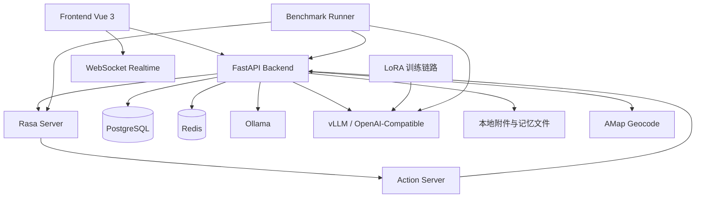

# 项目架构设计

## 1. 设计目标

Rasa-EC-bot 当前不是单一聊天机器人，而是一个围绕电商客服场景构建的完整实验系统。系统需要同时满足四类目标：

- 电商业务可运行：支持用户侧商城、购物车、下单、订单查询，以及商家侧商品管理、发货、售后处理。
- 客服链路可组合：支持规则型问答、事务查询、复杂多轮问答、知识检索、图片售后与待确认写操作。
- 本地模型可替换：支持基础模型、LoRA 微调模型、视觉模型、向量模型的独立部署与切换。
- 评测链路可复现：支持黑盒 benchmark、双榜排名、结果分析与论文复用。

系统采用“业务系统 + 混合客服路由 + 本地模型服务 + 独立 benchmark 工程”的拆分方式，避免业务逻辑、模型试验和评测工具链耦合在同一层。

## 2. 当前新增创新点

相对项目早期版本，当前架构新增并稳定落地了以下创新点：

- 双层服务端会话记忆：把聊天记忆拆成“会话上下文快照”和“用户全局长期记忆”，同时持久化到 PostgreSQL 与 Markdown 文件，既便于运行时加载，也便于人工审查和实验展示。
- 混合路由复审机制：后端不再简单做“Rasa 或 Agent”二选一，而是在 Rasa 意图识别之后加入复杂度判断与 LLM 复审，降低业务型问题误路由。
- 显式推荐约束解析：商品推荐链路新增预算、颜色、常见规格词解析与硬约束过滤，避免把不满足条件的候选商品混入推荐结果。
- 待确认事务执行边界：所有高风险写操作统一先生成待确认卡片，再由用户通过显式确认接口提交，模型只能生成草案，不能直接落库。
- 提示词外置与版本追踪：Agent 最终回答、Rasa 复审、图片分析提示词都外置到 `backend/prompts/`，benchmark 会记录路径与 SHA-256，保证实验结果可追溯。
- 双榜 benchmark 体系：benchmark 从旧式单榜口径升级为 `shared_core` 与 `agent_extension` 双榜，并引入样本去重、覆盖率、主失败原因和多标签失败诊断。
- benchmark 污染隔离：benchmark 会话使用专门的 `benchmark_...` session id，后端自动跳过会话记忆加载与刷新，避免测试数据污染真实记忆。
- 实时通知与地理化物流展示：后端通过 WebSocket 推送购物车、订单、售后、物流投诉、库存变化事件；物流链路加入地理坐标和路径点，前端可以做地图化展示。

## 3. 总体架构

### 3.1 逻辑分层



### 3.2 分层职责

#### 前端层 `frontend/`

- 基于 Vue 3 + Vite + Pinia + Vue Router。
- 承担商城、订单、商家中心、客服聊天、物流地图展示。
- 通过统一 REST API 与 WebSocket 接入后端。
- 聊天页采用固定面板高度、内部滚动、统一会话卡片尺寸，保证长会话场景下界面稳定。

#### 后端应用层 `backend/`

- 基于 FastAPI + SQLModel + SQLAlchemy Async。
- 提供业务 REST API、聊天入口、附件上传、知识库索引、实时通知、内部摘要接口。
- 负责客服路由决策、Agent 编排、待确认操作、会话记忆、推荐过滤和多模态处理。

#### 对话编排层 `rasa/`

- 承担高频、确定性、低风险、结构稳定的规则型客服问题。
- 主线数据位于 `rasa/data/main/`。
- `benchmark/rasa_only/` 保留纯 Rasa 对照配置，用于 benchmark 基线。

#### 模型服务层 `Ollama + vLLM`

- Ollama：基础聊天模型、视觉模型、向量模型。
- vLLM / OpenAI-Compatible：加载 LoRA adapter 的主 Agent 推理入口。
- LoRA 训练与推理运行时解耦，训练产物默认以 adapter 形式交付。

#### 实验评测层 `benchmark/`

- 作为独立 `uv` 工程维护，不再混在后端目录内。
- 负责数据集构建、黑盒执行、结果聚合、分析报告、图表输出。

## 4. 当前目录与模块边界

```text
Rasa-EC-bot/
├─ frontend/                  Vue 前端，包含商城、订单、商家中心、客服页面
├─ backend/                   FastAPI 后端与聊天编排主入口
│  ├─ app/                    业务 API、聊天路由、记忆、推荐、实时推送
│  ├─ prompts/                外置提示词
│  ├─ db/                     初始化 SQL 与种子数据
│  └─ scripts/                PostgreSQL / Redis 初始化脚本
├─ rasa/                      Rasa 主线规则与 rasa_only 基线
├─ LoRA/                      数据准备、训练、评估、导出、adapter 产物
├─ benchmark/                 独立 benchmark 工程
│  ├─ datasets/               core / extended 数据集
│  ├─ kb_seed/                知识库种子文档
│  ├─ scripts/                build / run / analyze 脚本
│  └─ src/benchmark/          数据集、执行器、评分、报告生成
├─ tests/                     后端核心逻辑单测
└─ design.md                  当前架构设计文档
```

边界原则：

- `frontend/` 不直接依赖模型服务，只依赖后端协议。
- `rasa/` 不直接访问数据库，优先通过后端内部摘要接口获取业务数据。
- `LoRA/` 不直接依赖业务运行，只负责训练与产物交付。
- `benchmark/` 只走黑盒接口，不直接调用后端内部函数。

## 5. 后端核心架构

### 5.1 聊天统一入口

统一入口为：

- `POST /api/v1/chat/send`
- `POST /api/v1/chat/upload-image`
- `POST /api/v1/chat/pending-action/decision`

前端始终使用统一响应结构：

- `messages[].text`
- `messages[].cards`
- `messages[].actions`

因此前端不需要知道底层是 Rasa、Agent、知识库还是图片分析。

### 5.2 混合路由架构

当前聊天路由不是简单的静态分流，而是四步决策：

1. 基于消息内容做领域识别与复杂度判断。
2. 调用 Rasa `/model/parse` 获取意图和置信度。
3. 对高频业务意图执行 LLM 复审，判断是继续走规则链路还是切到 Agent。
4. 将最终路由元数据写入消息持久化记录，便于排障和分析。

当前路由层的核心价值：

- 高频确定性问题优先走规则链路，保持稳定、低成本、低时延。
- 复杂、多领域、跨步骤问题自动切到 Agent，保留推理能力。
- 对业务类意图加入 LLM 复审，减少 Rasa 高置信误命中的副作用。
- 路由结果与原因可追踪，可进入测试与 benchmark 分析。

### 5.3 Rasa 规则链路

适合以下类型：

- 问候与轻量 FAQ
- 商品推荐类标准问法
- 订单查询
- 物流查询
- 售后进度查询

处理流程：

1. 后端转发到 Rasa。
2. Rasa 命中 `intent + rule`。
3. 如需业务数据，调用 Action Server。
4. Action Server 再访问后端内部摘要接口，而不是直接碰数据库。
5. 后端统一把结果组装成前端协议。

这一设计保留了可控性，也为 `rasa_only` benchmark 基线提供了干净实现。

### 5.4 Agent 编排链路

Agent 由 `backend/app/nexau_orchestrator.py` 负责编排，采用轻量 ReAct 风格：

- 先做领域推断和工具规划。
- 工具分为 `read` 与 `write` 两类。
- `read` 工具可自动执行，例如订单摘要、物流摘要、售后摘要、推荐查询、知识检索、图片分析。
- `write` 工具不直接落库，而是只生成待确认草案。
- 最终由 Agent 汇总 observation，调用外置提示词生成回答。

当前 Agent 的设计边界很明确：

- 读操作自动执行。
- 写操作只允许“生成草案 -> 用户确认 -> 后端执行”。
- 模型本身不拥有直接数据库写权限。

### 5.5 待确认事务执行机制

这是当前系统最重要的安全边界之一。

适用场景包括：

- 结算下单
- 发起售后
- 取消订单
- 修改发货信息
- 发起物流投诉

实现方式：

1. 用户在聊天中表达操作意图。
2. 后端生成 `pending_action` 卡片和 `pending_action_decision` 按钮。
3. 待确认 payload 存入 PostgreSQL + Redis。
4. 用户通过显式确认接口提交 `confirm` 或 `cancel`。
5. 后端执行真实写操作，并清理待确认状态。

这套机制把“自然语言理解”和“业务提交”分离开来，降低了误执行风险，也让 benchmark 可以评测确认、取消、过期等完整流程。

## 6. 服务端会话记忆设计

### 6.1 设计目标

当前记忆系统的目标不是单纯保留聊天记录，而是为 Agent 提供结构化、可控、可压缩的长期上下文。

### 6.2 双层记忆结构

#### 会话级记忆

- 表：`chat_sessions`、`chat_messages`、`chat_context_snapshots`
- 文件：`backend/data/chat_memory/<user>/<session>/context_memory.md`
- 作用：保存单个会话的上下文摘要、最近窗口、快照版本

#### 用户级全局记忆

- 表：`chat_user_global_memory`
- 文件：`backend/data/chat_memory/<user>/global_memory.md`
- 作用：沉淀用户长期偏好，如预算、颜色、品牌、场景、相关订单

### 6.3 记忆提取与压缩

记忆刷新时，系统会从用户消息中提取：

- 预算
- 颜色
- 规格
- 品牌
- 使用场景
- 订单号
- 主题标签

当消息数量或字符数达到阈值时，系统会触发快照压缩，生成新的上下文摘要和最近窗口，并更新数据库与 Markdown 文件。

### 6.4 benchmark 隔离

benchmark 会话使用 `benchmark_` 前缀 session id。后端检测到此类会话后，会跳过：

- 记忆加载
- 记忆刷新
- 真实用户长期记忆污染

这保证实验样本不会影响后续真实会话和重复实验。

## 7. 商品推荐架构

### 7.1 推荐链路定位

推荐不是单独的推荐系统服务，而是嵌入客服链路中的“轻量业务推荐能力”。

其输入来自三部分：

- 用户当前查询
- 用户近期浏览历史
- 商品基础属性与运营标签

### 7.2 新增的显式约束解析

当前推荐链路新增了三类硬约束：

- 预算约束：例如“4000 元以下”
- 颜色约束：例如“白色”“月岩白”
- 规格约束：例如“27 寸”“Type-C”“12GB+512GB”

处理流程：

1. 从自然语言中抽取预算上限、必需词、偏好词。
2. 对商品文本做统一归一化。
3. 用硬约束先过滤不满足条件的候选。
4. 再结合浏览历史和排序指标生成推荐。
5. 在 observation 中记录匹配原因，便于调试和解释。

这部分是当前系统相对早期版本最直接的功能增强，已经用于修复“超预算或颜色不符商品被错误推荐”的问题。

## 8. 多模态与知识增强

### 8.1 知识库增强

知识增强由后端统一维护，核心能力包括：

- 文档切块
- embedding
- pgvector 检索
- 检索结果回填到 Agent / 图片分析链路

典型知识源：

- 售后政策
- 商品说明书
- benchmark 种子知识文档

### 8.2 图片售后分析

图片售后采用两段式流程：

1. 上传图片，获得 `attachment_id`
2. 在聊天消息中携带 `attachments`

后端会：

- 校验 MIME 与体积
- 文件落盘
- 调视觉模型做结构化分析
- 将分析结果以 `image_analysis` 卡片返回
- 支持继续生成售后待确认草案

这让系统从“纯文本客服”扩展到“图片佐证 + 售后判断”的多模态客服。

## 9. 物流与实时通知架构

### 9.1 地理化物流链路

当前物流系统不仅维护文本状态，还维护：

- `current_lng`
- `current_lat`
- `route_geo`

后端可结合 AMap geocode 将路线节点转成地理点，用于：

- 订单详情地图展示
- 物流当前位置推断
- 运输路线可视化

### 9.2 WebSocket 实时事件

后端开放：

- `GET /ws/realtime`

用于向用户侧和商家侧广播：

- 库存变化
- 购物车变化
- 订单变化
- 售后变化
- 物流投诉变化

这使前端页面不必完全依赖轮询，尤其适合商家中心、订单页和购物车页的状态同步。

## 10. 模型服务与 LoRA 训练链路

### 10.1 运行时模型分工

当前推荐口径：

- 基础聊天模型：`qwen3.5:2b`
- Agent 默认模型：`qwen3.5-2b-lora`
- 多模态模型：`qwen3-vl:2b`
- 向量模型：`mxbai-embed-large`

### 10.2 LoRA 训练工程 `LoRA/`

LoRA 工程与运行时后端解耦，负责：

- SFT 数据准备
- 数据源过滤
- QLoRA 训练
- 评估
- 导出 Ollama / 其他格式

默认部署链路不是把 LoRA 合并回基础模型，而是输出 adapter，由 vLLM / OpenAI-Compatible 在推理时动态加载。

### 10.3 提示词外置

当前关键提示词全部外置：

- `backend/prompts/agent_final_answer.md`
- `backend/prompts/rasa_review.md`
- `backend/prompts/image_analysis.md`

好处有三点：

- 业务逻辑与提示词解耦
- benchmark 可以记录提示词版本
- 便于迭代提示词而不污染代码主体

## 11. Benchmark 架构设计

### 11.1 独立工程化

当前 benchmark 已从旧版后端内嵌脚本演化为独立工程 `benchmark/`，拥有自己的：

- `pyproject.toml`
- 数据集目录
- 执行器
- 评分器
- 报告生成器

这使业务运行和实验运行可以独立演进。

### 11.2 双榜设计

当前正式结果不再输出单一综合冠军，而是拆成：

- `shared_core`
- `agent_extension`

含义：

- `shared_core` 评估各系统都应具备的共享核心客服能力。
- `agent_extension` 评估知识检索、多模态、待确认动作等增强能力。

这样可以避免纯规则系统和带智能体扩展系统被强行放进同一条结论线上比较。

### 11.3 数据集结构

当前数据集位于：

- `benchmark/datasets/core/`
- `benchmark/datasets/extended/`
- `benchmark/datasets/manifest.json`

场景族固定为：

- `recommendation`
- `order_query`
- `logistics_query`
- `after_sales_query`
- `knowledge_and_multimodal`
- `transactional_action`

其中：

- `core` 用于正式实验主集
- `extended` 用于回归和补充实验

### 11.4 黑盒执行原则

benchmark 只通过外部接口工作：

- 聊天发送接口
- 图片上传接口
- 待确认决策接口
- 登录接口
- 知识库写入接口

不允许直接调用内部 Python 函数，因此结果更接近真实部署场景。

### 11.5 结果与分析创新

当前 benchmark 输出新增了以下分析能力：

- 样本级唯一区分与覆盖率统计
- `failure_breakdown.csv` 主失败原因
- `failure_flags.csv` 多标签失败诊断
- `prompt_versions.json` 提示词版本记录
- 中文化分析报告与图表
- `shared_core` / `agent_extension` 双榜 SVG 图表

正式排序优先依据：

1. `suite_family_macro_pass_rate`
2. `suite_unique_micro_pass_rate`
3. `suite_family_macro_success_rate`
4. `eligibility_rate`

### 11.6 benchmark 与业务系统的接口契约

benchmark 不要求业务为测试专门新增协议，而是复用现有聊天协议，因此它同时起到了：

- 回归测试
- 能力基线测试
- 论文实验评测

三种角色。

## 12. 数据层设计

### 12.1 PostgreSQL

PostgreSQL 是主数据库，负责：

- 用户、商家、店铺
- 商品、购物车、订单、物流、售后、投诉
- 聊天会话、消息、上下文快照、全局记忆、待确认操作
- 知识库文档与向量元数据

### 12.2 Redis

Redis 主要承担：

- 商品筛选元数据缓存
- 订单/物流/售后摘要缓存
- 会话记忆 bundle 缓存
- pending action 状态缓存
- 分布式锁与去抖

设计原则是缓存“摘要和派生结果”，而不是全量复制业务表。

### 12.3 文件系统

本地文件系统承担两类派生产物：

- `backend/data/chat_uploads/`：用户上传附件
- `backend/data/chat_memory/`：会话记忆与全局记忆 Markdown

这种设计降低了对象存储依赖，适合本地部署和实验演示。

## 13. 安全边界与可靠性设计

当前架构明确保留以下边界：

- 聊天协议统一，但底层实现可替换。
- Rasa 与 Agent 共存，而不是互相覆盖。
- 模型无直接数据库写权限。
- 所有写操作必须经过显式确认。
- benchmark 不污染真实用户记忆。
- 提示词、路由、失败原因都可追踪。

为保证稳定性，系统还做了以下处理：

- 路由元数据持久化，便于排查错路由。
- `session_id` SQL 参数显式类型转换，避免 asyncpg 推断冲突。
- 物流与发货流程做幂等保护，降低并发重复提交影响。
- 实时通知与页面刷新结合，避免单纯依赖 WebSocket 单点。

## 14. 推荐启动顺序

完整开发或演示环境推荐按以下顺序启动：

1. PostgreSQL
2. Redis
3. FastAPI 后端
4. Ollama
5. vLLM / OpenAI-Compatible LoRA 服务
6. Rasa Server
7. Action Server
8. 前端
9. benchmark（按需）

如果只跑 benchmark，可以只启动与目标系统对应的最小依赖集合。

## 15. 后续扩展方向

- 继续把会话记忆从规则提取升级为更细粒度的长期偏好建模，但仍保留当前可审计的 Markdown 产物。
- 把推荐链路扩展为“硬约束过滤 + 个性化排序 + 解释生成”的更稳定模块。
- 将待确认动作抽象为统一事务框架，进一步减少聊天链路中的重复业务模板。
- 继续增强 benchmark 的错误归因、回放能力和论文附录自动产出。
- 在不破坏黑盒原则的前提下，为路由、工具调用和多模态分析增加更细的可观测性。
